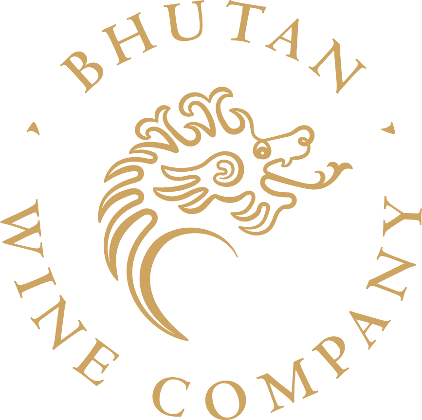

<div align="center">



# Master of Wine — Practical Exam Study Engine

### A research-grounded blind-tasting trainer that learns from every candidate who uses it

*Built by the [Bhutan Wine Company](#) · Powered by 14 years of real MW exams*

[**▶ Open the app**](https://study-app-blond-nine.vercel.app) · [Read the methodology](https://study-app-blond-nine.vercel.app/methodology)

</div>

---

## What this is

The **Master of Wine (MW) practical exam** is one of the hardest assessments in the wine world. Over three days, candidates blind-taste **36 wines** — 12 whites, 12 reds, and 12 of everything else (sparkling, fortified, sweet, rosé, oxidative) — and have only about **eight minutes per answer** to identify each wine's grape, origin, and quality, and to justify every conclusion.

This project is a **study engine** that helps candidates train for that exam. It does three things no flashcard deck or textbook can:

1. **It predicts.** Before you even taste, it tells you what a wine is *most likely* to be, what it *could plausibly* be, and exactly what to taste for to tell the difference.
2. **It generates unlimited, exam-realistic practice.** It writes brand-new mock exams that are statistically indistinguishable from real MW papers — then marks your answers the way a real examiner would.
3. **It improves itself.** Every time an expert candidate disagrees with it, the system checks that disagreement against 14 years of real exams, and — when the candidate is right — *rewrites and re-deploys its own code automatically.*

That last point is the heart of this project, and we'll come back to it.

---

## The big idea

> **The MW practical exam is not random. It follows patterns — in question structure, wine selection, mark allocation, and what examiners reward. Those patterns are invisible in any single year but unmistakable across a decade.**

Most candidates study by tasting a lot of wine and hoping. We took the opposite approach: we treated **the exam itself** as the thing to study. We gathered every modern MW practical paper, found the hidden structure, and turned it into a decision-making edge you can carry into the tasting room.

---

## How we built it

Think of it as building a master taster's instinct — but from evidence instead of decades of experience.

### 📚 Step 1 — Assemble the complete corpus

We collected the full text of **every MW practical exam from 2011 to 2025** — 14 years (2020 was cancelled). This isn't a sample. It's the *entire* modern exam.

| 14 | 42 | 504 | 13 |
|:--:|:--:|:--:|:--:|
| **exam years** | **papers** | **individual wines** | **examiner reports** |

Every one of the **504 wines** was individually researched from authoritative sources — producer websites, Decanter, JancisRobinson.com, Tim Atkin MW, regional wine-board tech sheets — documenting its tasting profile, technical detail, vintage character, and *why the examiners likely chose it.*

### ⚖️ Step 2 — Learn how examiners actually mark

We read **13 official examiner reports** and distilled them into the **Seven Cardinal Rules** of MW marking — the principles that appear in every report. The most important one surprises most people:

> **Reasoning beats identification.** A *wrong* answer with sound reasoning scores more than a *right* answer with none.

The other six cover contextualizing quality, never forcing tasting notes to fit a guess, answering the actual question asked, the four required elements of a maturity assessment, being specific about commercial positioning, and treating structure (acid, tannin, body, alcohol) as the foundation that aromatics only confirm.

### 🧭 Step 3 — Find the hidden structure

MW questions cluster into recurring **families** — the same logical patterns reappear year after year. We classified all of them and extracted **30 numbered patterns** from the corpus. A few examples:

- **Chardonnay appears in Paper 1 every single year** (10 of 10).
- **Paper 3, Question 1 has been sparkling four years running.**
- **The "1-in-4" curveball rule:** in a typical multi-wine question, usually *exactly one* wine is the hard one. The rest are anchors.

### 🌳 Step 4 — Build the decision trees

This is the core study artifact. From question-by-question analysis we synthesized **three master decision trees** — one per paper — each with two layers:

- **Layer A — Pre-Tasting:** what the *question wording alone* tells you before you smell anything. It routes you to the right family and narrows the candidates.
- **Layer B — In-Glass:** what your senses confirm. Which Layer-A predictions survive what you actually taste?

Paper 3 even has a **Visual Triage** step: *before smelling*, just look at the glass. Bubbles → sparkling. Amber → oxidative. Pink → rosé. That one glance collapses "could be anything" into a specific category.

The trees target **variety + region** — e.g. "Barossa Shiraz," "Burgundy Chardonnay" — because that's what passes the exam. Naming the exact producer is a bonus; getting the grape and origin right is the whole game.

### 🎯 Step 5 — Prove it works (backtesting)

We didn't just *assert* the trees were good. We tested them with **Leave-One-Year-Out cross-validation**: train on 9 years, predict the year we hid, repeat for all 10. Then we scored every prediction against the real wines.

Then we found the weaknesses, fixed them, and tested again. **Here's how much better it got:**

| Metric | Before | After | Plain English |
|:--|:--:|:--:|:--|
| **Top guess is correct** | 51.3% | **72.8%** | ~3 in 4 wines, the #1 prediction nails the grape |
| **Correct grape in top 3** | 70.7% | **89.2%** | ~9 in 10 wines, the answer is in the shortlist |
| **Correct grape somewhere in the set** | 82.5% | **95.6%** | the right answer is almost always on the radar |

For reference, *guessing* the most common grape scores **16.9%**. The trees more than **quadruple** that.

A separate model even predicts what *next year's* exam will contain — and on 2022–2025 it called the **question count with 100% accuracy** and the wine **style with 97.6%** top-3 accuracy.

---

## What you actually get as a candidate

- **🔮 Decision matrices** — for any question, the path from wording to a ranked shortlist of likely wines, tagged **Strong Signal**, **Plausible**, or **Curveball**.
- **📝 Unlimited mock exams** — fresh, exam-realistic papers generated on demand, each one passed through **three layers of quality control and five automated validators** so it behaves like a real MW paper (no reds sneaking into Paper 1, no impossible blends, the right curveball budget).
- **🎓 Examiner-calibrated marking** — submit your answer and get it scored against the Seven Cardinal Rules, with estimated marks per sub-question and a pass / borderline / fail verdict. It *rewards* good reasoning even when your identification is wrong — exactly as a real examiner would.
- **🧠 Pre-glass coaching** — write your reasoning *before* you taste, and the system tells you what signals you missed and what to look for in the glass.

---

## ✨ The part that makes it special: it improves itself

A study tool is only as good as the day it was built — unless it can learn. This one does, and it does it **automatically and safely.**

Here's what happens when an expert candidate flags something — *"a real MW exam would never put these two wines together":*

```
   Candidate leaves feedback on a generated question
                      │
                      ▼
   ① AI analysis — Claude reads the feedback and checks it
      against all 14 years of real exams, fact-checking
      specific wine claims against the live web.
                      │
        ┌─────────────┼─────────────┐
        ▼             ▼             ▼
   The corpus     Partly       The candidate
   proves the     right        found a real gap
   candidate                   the exam has
   wrong                       never shown
        │             │             │
        ▼             ▼             ▼
   ② Politely     Flagged for   ② The system writes
   REJECTED with  human eyes    a fix to its own code,
   a cited                      verifies it compiles &
   explanation                  builds, retries until
                                green, then ships it
                                live — by itself.
```

The key principle: **the corpus is the authority, not opinion.** If a candidate says "the exam would never do this" but the past papers show it *has*, the system respectfully declines and explains why, with a historical citation. If the candidate found something genuinely missing, the system fixes it.

And when a fix is warranted, the loop closes *without a human touching the keyboard*:

> A behind-the-scenes pipeline writes the code change, then runs the real build and type-checks. If anything fails, it reads its own error output and **tries again — up to three times — healing its own mistakes.** Only when everything passes green does it merge and deploy to the live site. If it can't get to green, it opens a request for a human to review instead. **The live site is never updated by a change that doesn't build.**

This is genuine, guarded self-improvement: expert insight in, corpus-validated, verified, and shipped — safely, on its own.

---

## 📈 Why it keeps getting stronger the more it's used

The system has **already** gone from 51% to 73% top-guess accuracy through iteration. But the most powerful engine for improvement isn't us — **it's the people using it.**

MW candidates are experts. Every time one of them pushes back on a question, three things happen:

1. **Their insight is tested** against 14 years of hard evidence — so only *correct* corrections get through.
2. **Verified corrections become permanent**, shipped to everyone instantly.
3. **The rejections teach too** — every "no" comes with a citation showing what the real exam has actually done, which is itself a study lesson.

The result is a flywheel: **more candidates → more expert feedback → more corpus-validated refinements → a sharper engine for the next candidate.** A wine textbook is frozen the day it's printed. This gets better every week someone uses it.

---

## What it is — and what it isn't

| ✅ It is | ❌ It isn't |
|:--|:--|
| Built on the **complete** modern MW corpus (14 yrs, 504 wines) | A magic shortcut — it gives a better starting position, not a guaranteed answer |
| Backtested to **72.8%** top-guess accuracy | A replacement for real tasting practice |
| Generation constrained by historical norms + validation | Infallible — ~1 in 4 top guesses is still wrong |
| Marking calibrated to **official examiner guidance** | Static — it learns from every new exam and every candidate |

> The trees don't tell you what the wine *is*. They tell you what it's most likely to be, what it could plausibly be, and what to taste for to tell the difference. **That's the edge.**

---

## For the technically curious

<details>
<summary>How it's built and run (click to expand)</summary>

- **Study app:** Next.js + React, deployed on Vercel → <https://study-app-blond-nine.vercel.app>
- **Data store:** Neon (serverless Postgres) for users, attempts, feedback, and analyses.
- **AI:** Anthropic Claude (Opus) for question generation, answer evaluation, and feedback analysis; Tavily for live web fact-checking.
- **Self-improvement loop:** the app fires a GitHub `repository_dispatch`; a GitHub Action runs headless Claude to make the change, gates it on `tsc` + `next build` with a 3-attempt self-heal loop, and merges to `master` (auto-deploy) only on green — otherwise it opens a PR.
- **The research corpus** (papers, wine research, decision trees, heuristics, backtests) lives in `data/` and `outputs/`; the Python tooling that builds and scores it lives in `scripts/` and `score_loyo.py`.

Repo layout, conventions, and the full agent/command catalogue are documented in [`CLAUDE.md`](CLAUDE.md). The complete methodology — corpus, taxonomy, trees, and backtest numbers — is laid out in the app's [Methodology page](https://study-app-blond-nine.vercel.app/methodology).

</details>

---

<div align="center">

*A study engine for the Master of Wine practical — grounded in evidence, sharpened by every taster who uses it.*

**🍷 Bhutan Wine Company**

</div>
