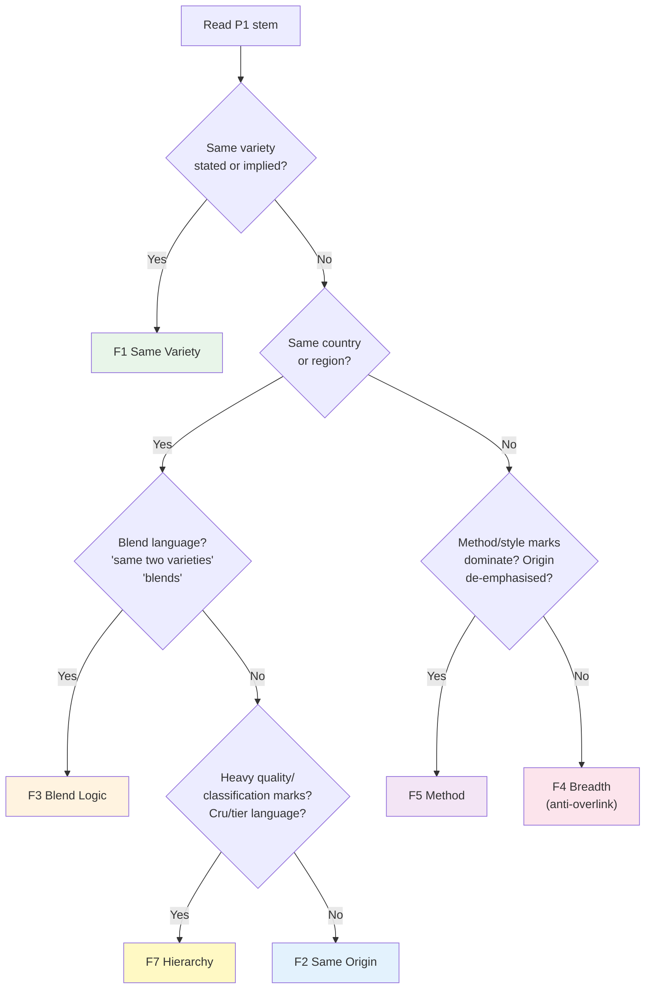
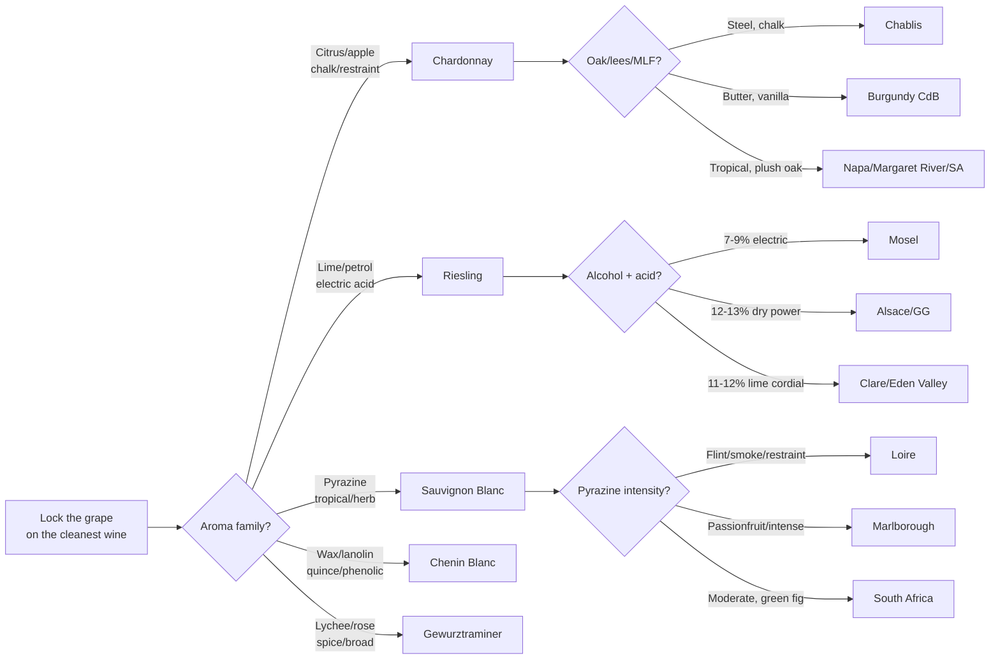
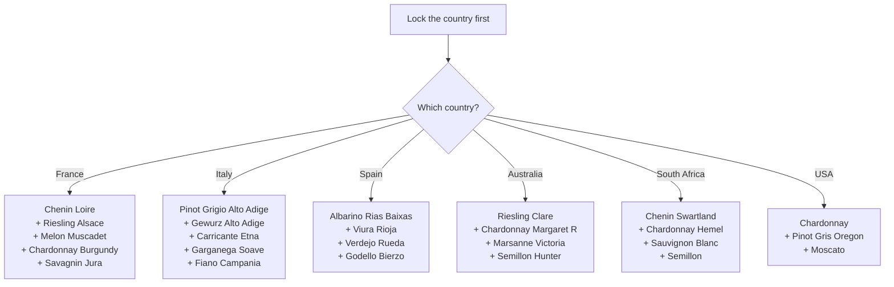
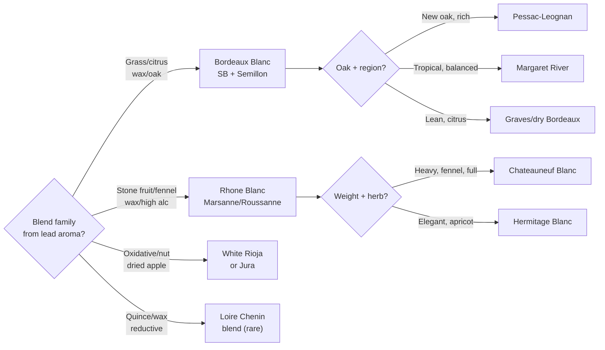
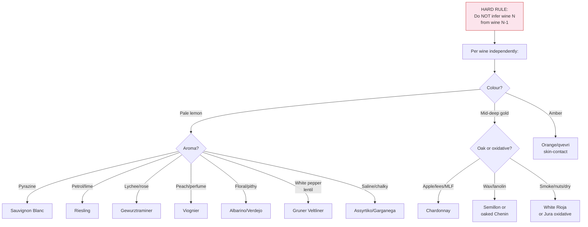
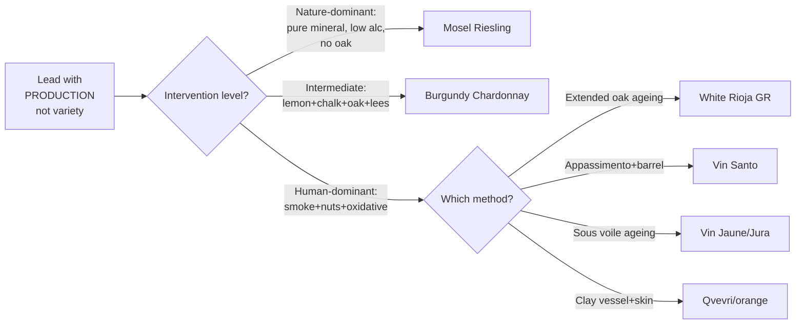
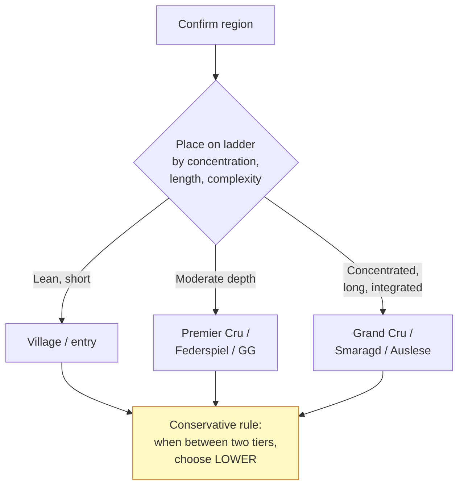

# P1 Whites -- Mermaid Study Diagrams

## 1. Stem Routing: Which Family?

## 2. F1 Same Variety -- Tasting Tree (11 questions)

## 3. F2 Same Origin -- Tasting Tree (8 questions)

## 4. F3 Blend Logic -- Tasting Tree (4 questions)

## 5. F4 Breadth -- Tasting Tree (9 questions)

## 6. F5 Method -- Key Signals (2 questions)

## 7. F7 Hierarchy -- Key Signals (3 questions)

