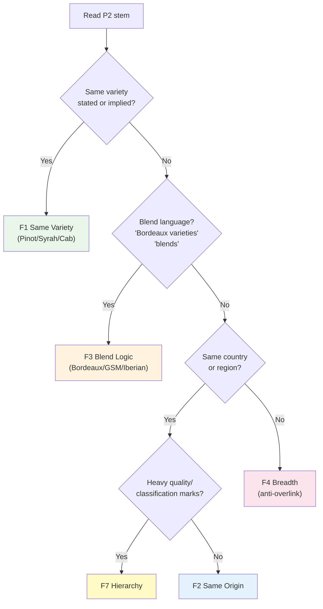
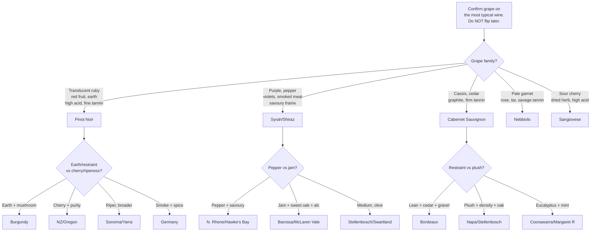
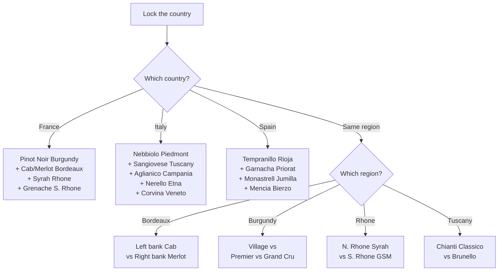
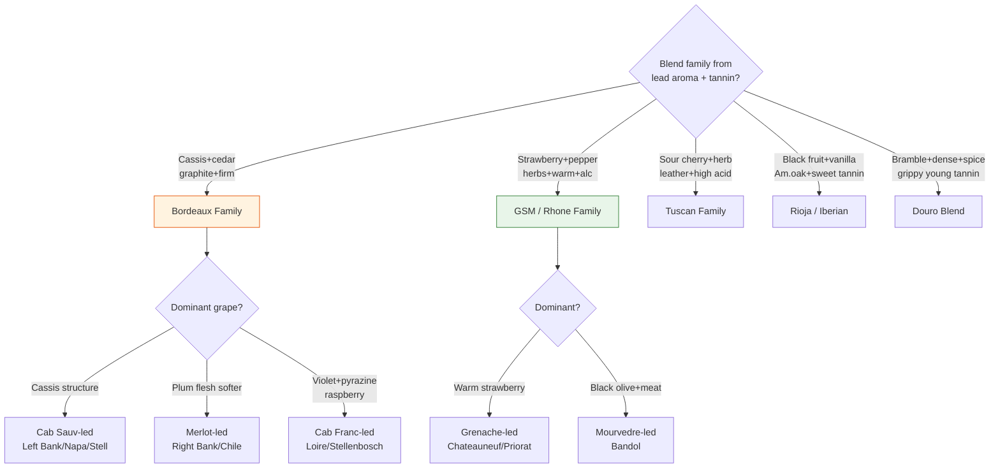
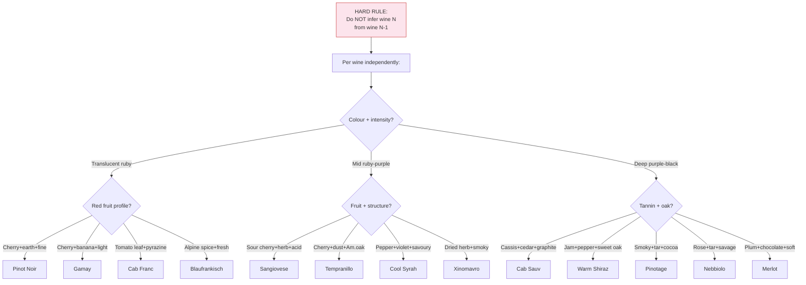
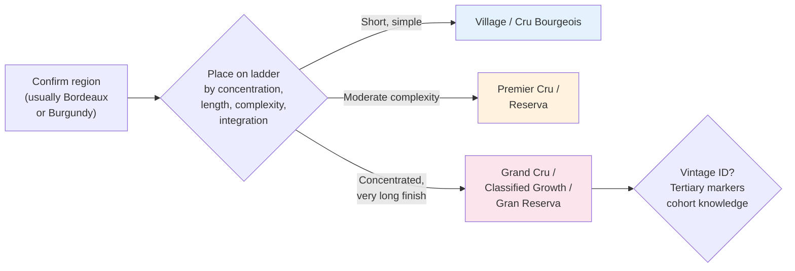

# P2 Reds -- Mermaid Study Diagrams

## 1. Stem Routing: Which Family?

## 2. F1 Same Variety -- Tasting Tree (10 questions)

## 3. F2 Same Origin -- Tasting Tree (8 questions)

## 4. F3 Blend Logic -- Tasting Tree (2 questions, high leverage)

## 5. F4 Breadth -- Tasting Tree (15 questions, largest bucket)

## 6. F7 Hierarchy -- Key Signals (2 questions)

