# P3 Special -- Mermaid Study Diagrams

> **P3 order of operations:** on Paper 3 you let your eyes lead. Start at the **Visual Triage trunk** (Section 1) to sort every wine into a production family by appearance, confirm with one sniff + one sip, then drop into the family sub-tree. Use **Stem Routing** (Section 2) as pre-tasting context to narrow region/variety once the family is fixed.

## 1. Visual Triage -- START HERE (the trunk of the tasting tree)

This is the root of the in-glass tree on P3. Run every wine through Gate 1 -> Gate 2 -> Gate 3; the first gate it trips assigns its family. Resolve any leftover ambiguity at the Step 2 confirmation gate.

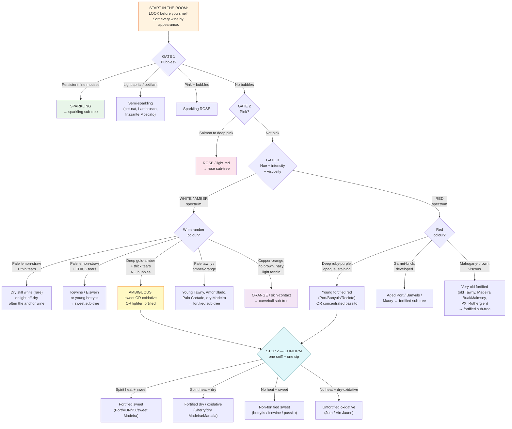

### Step 2 confirmation cues (resolve the look-alikes)

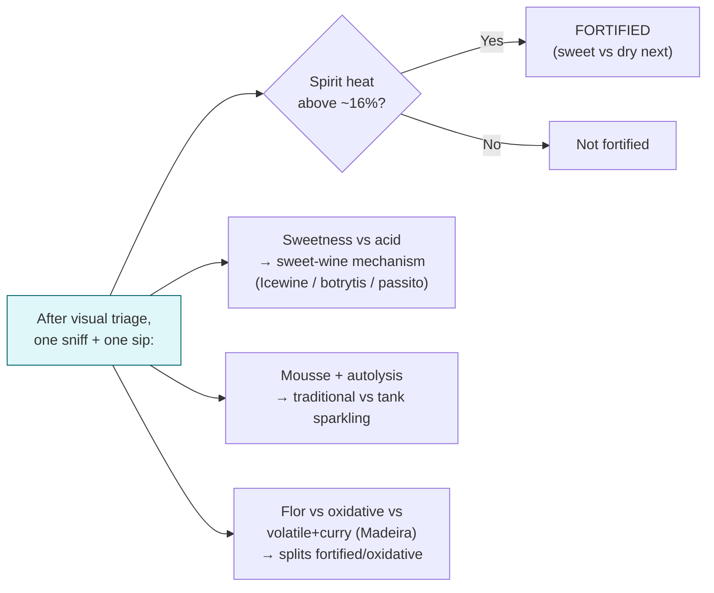

## 2. Stem Routing: Which Family? (pre-tasting / region overlay)

Read the stem first for context, but use it to *narrow region/variety once the visual trunk has fixed the family* -- not to guess the wine before you look.

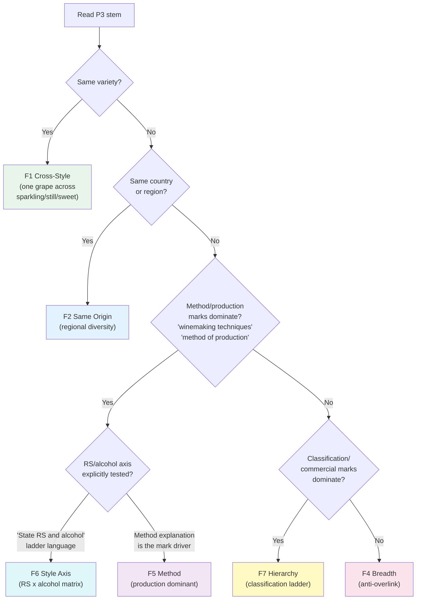

## 3. F5 Method -- THE Engine of P3 (10 questions)

### Step 1: Production Family Lock

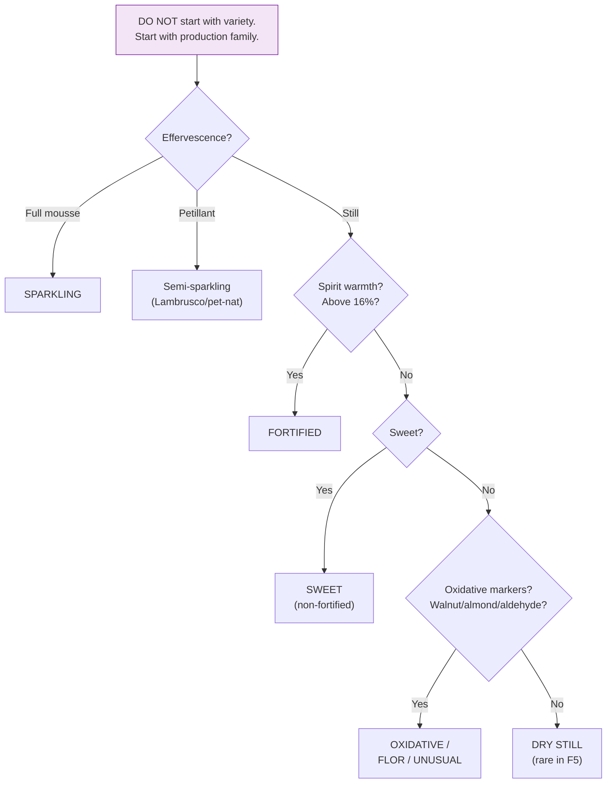

### Step 2: Within Each Family

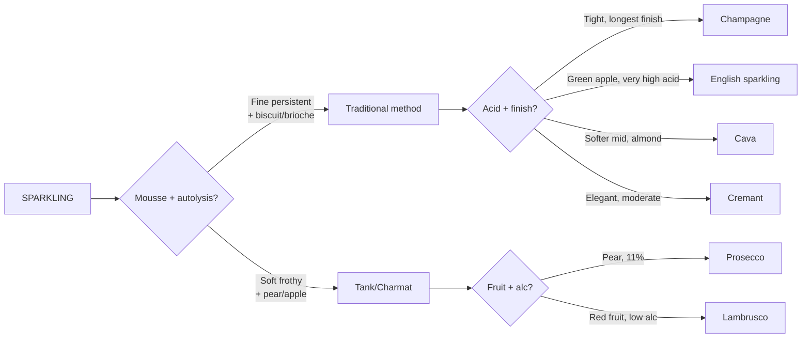

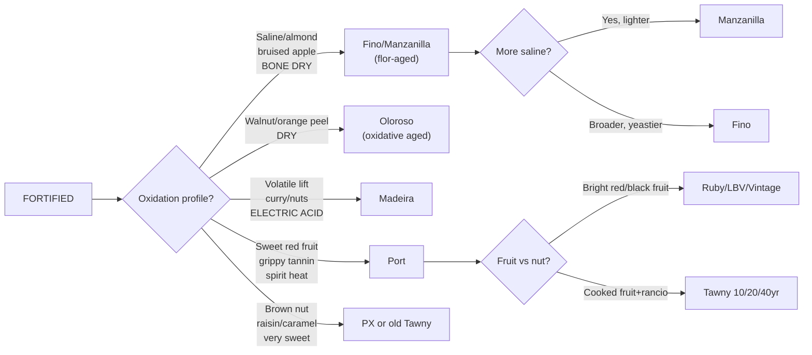

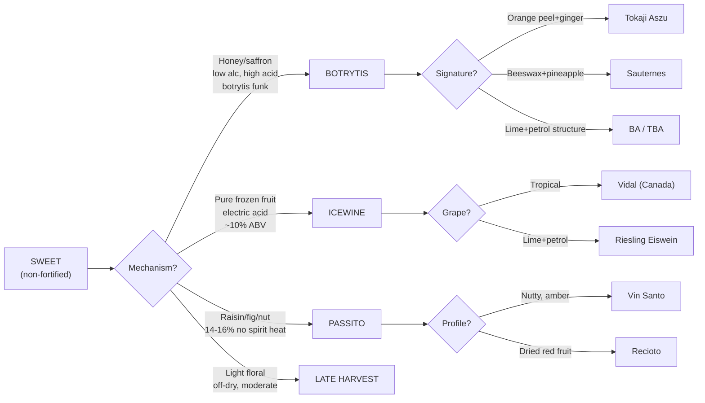

## 4. F4 Breadth -- Anti-Overlink (9 questions)

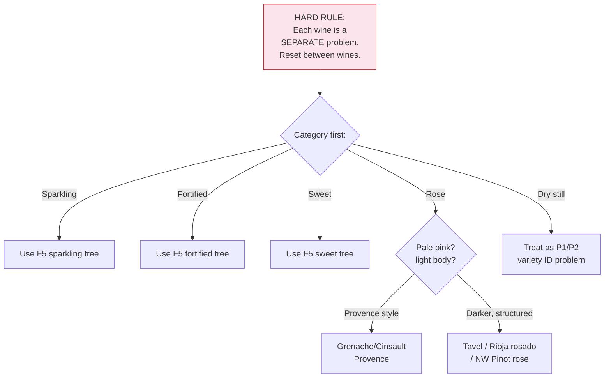

## 5. F1 Cross-Style Single Variety (4 questions)

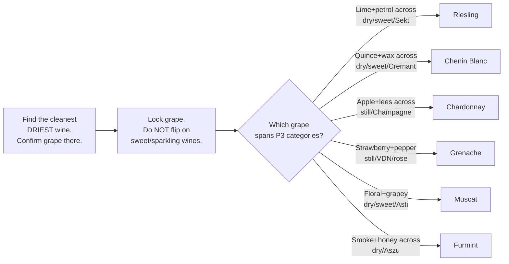

## 6. F6 Style Axis -- RS x Alcohol Matrix (4 questions)

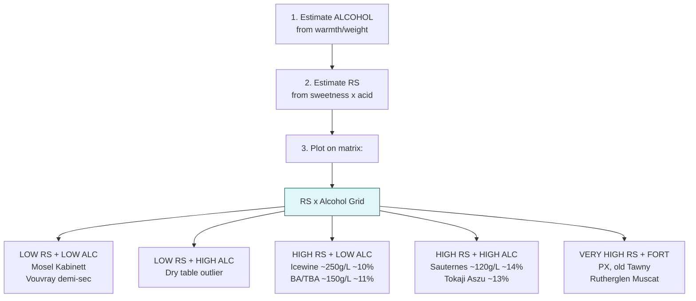

## 7. F7 Hierarchy -- Classification Cards (3 questions)

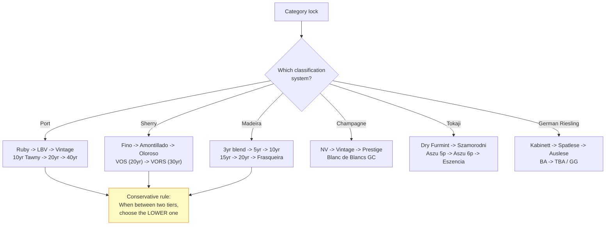
