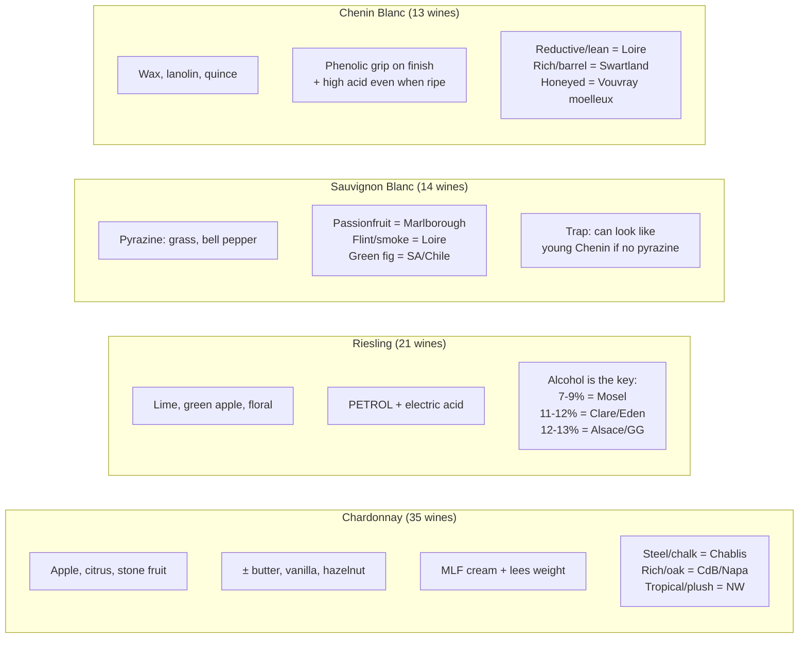
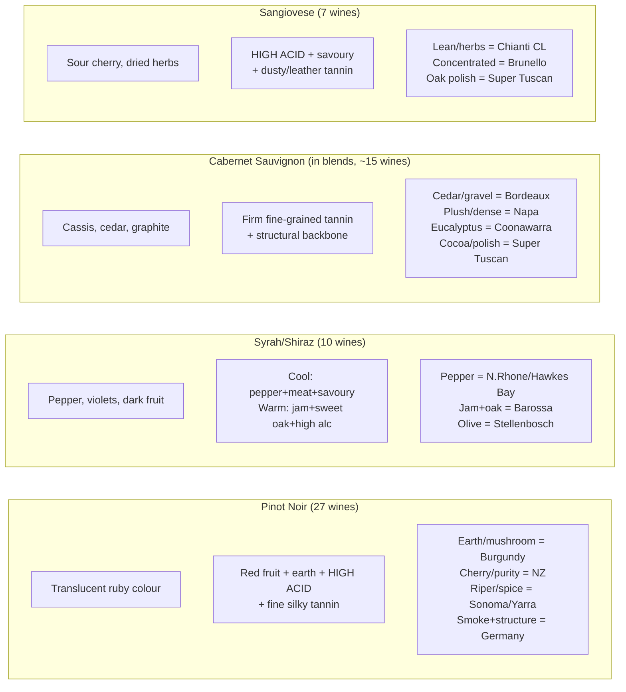
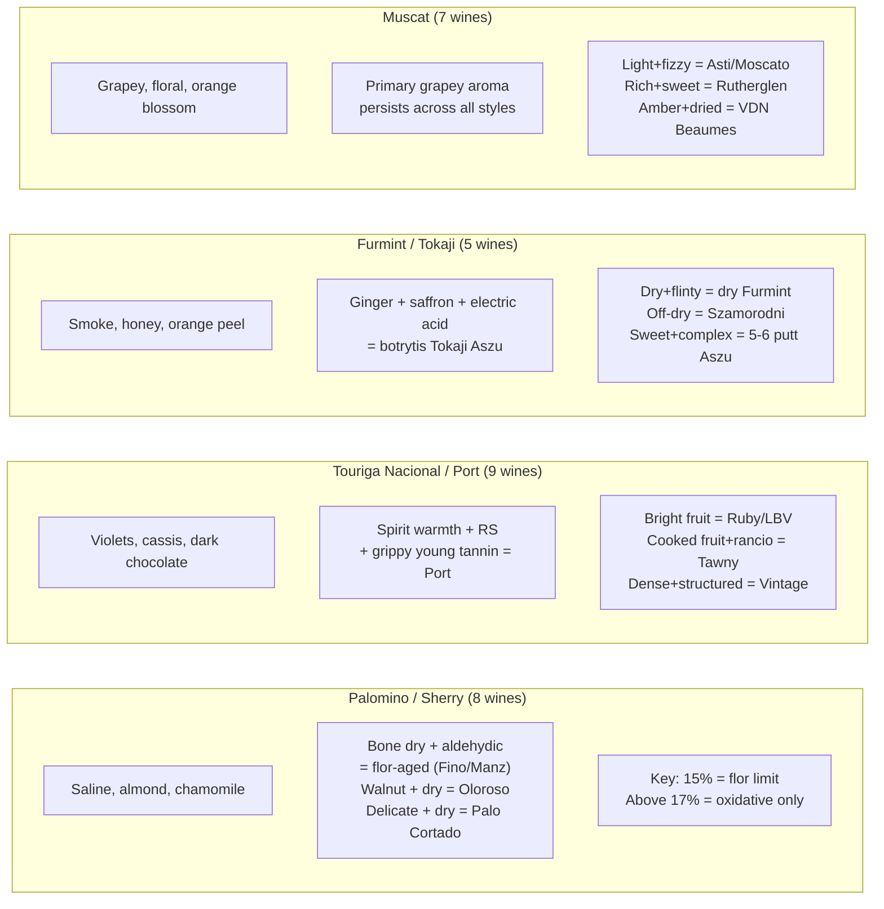
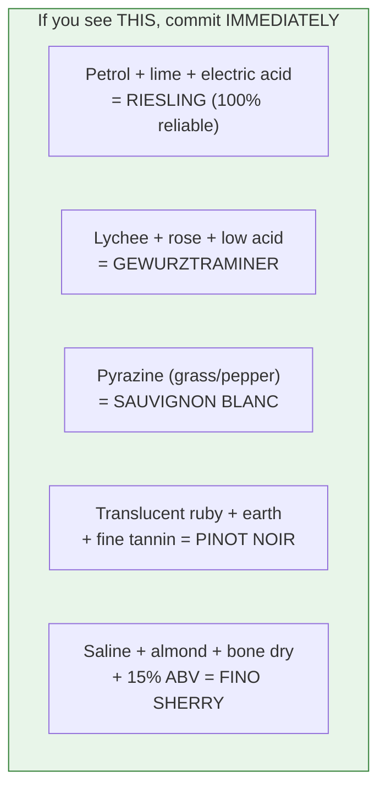

# Top Variety Confirmation Cards

The 12 most-tested varieties in the MW corpus with their diagnostic markers.

## White Varieties

## Red Varieties

## P3 Fortified/Sweet Varieties

## Quick-Reference: The 5 Killer Tells

